# Education-Portal
Youtube Link : https://youtu.be/DCQWFsMWGQE 

•	Created a web application  based on MVC architecture using J2EE  to enhance student -centered learning .  
•	Student can easily  register themselves and  update their profile.
•	Easily accessible  theory and  video lectures available for different courses on the portal. 

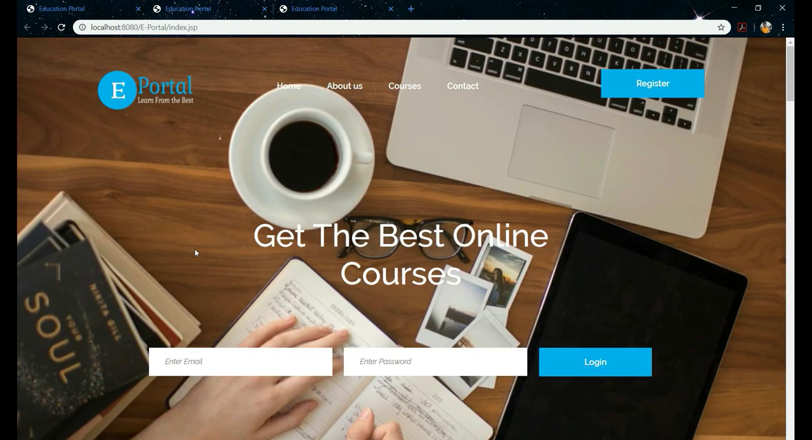
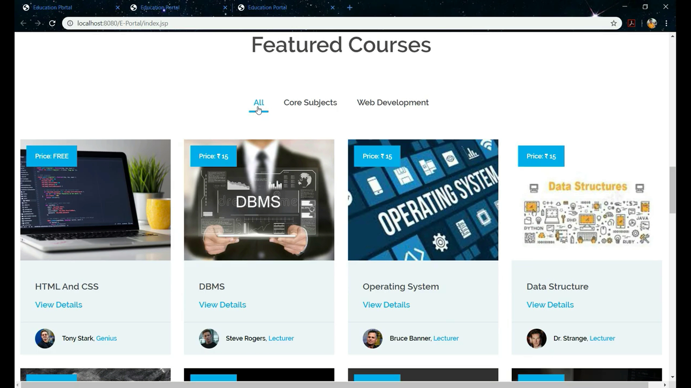
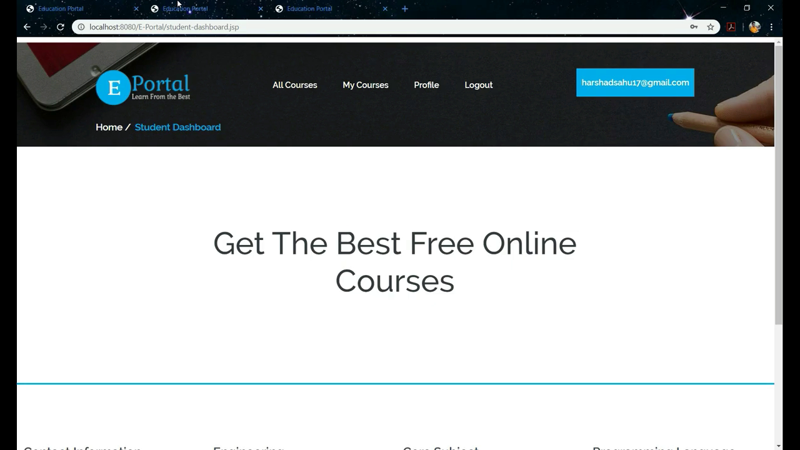
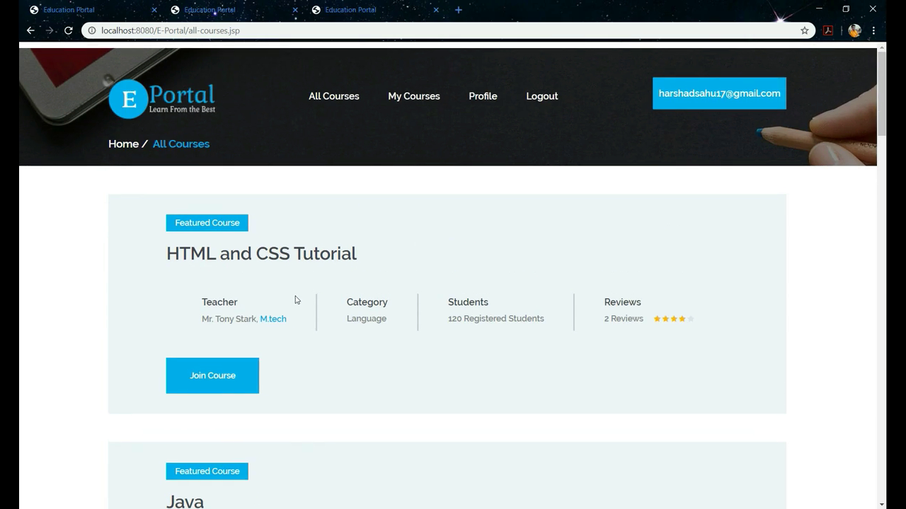
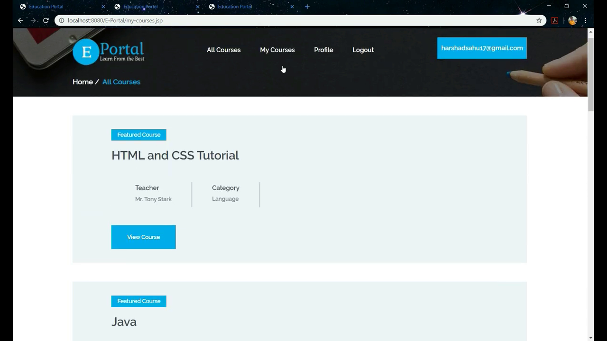
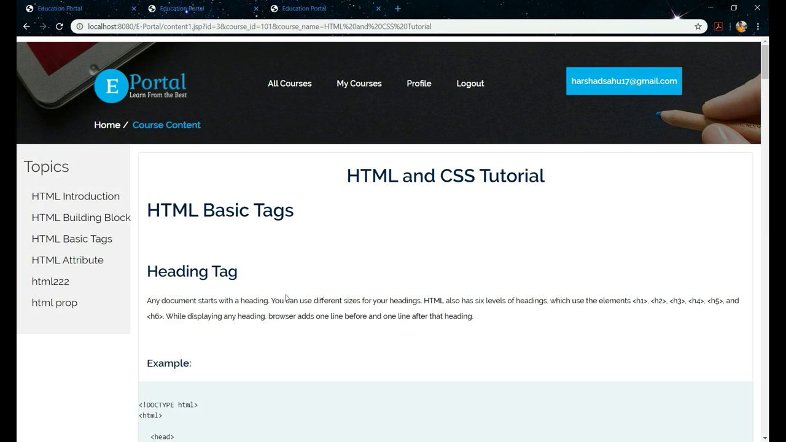
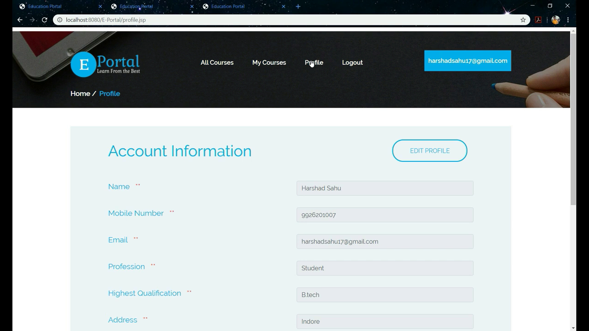
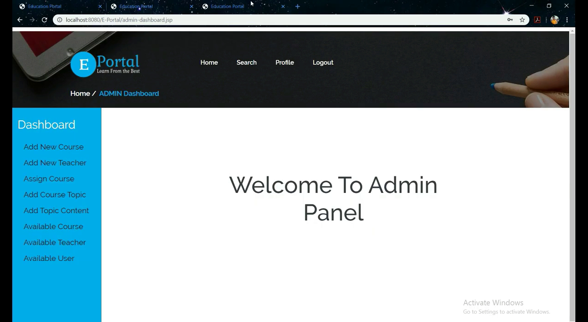
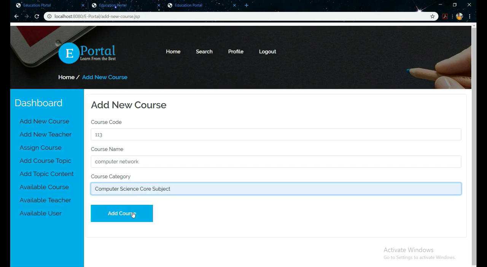
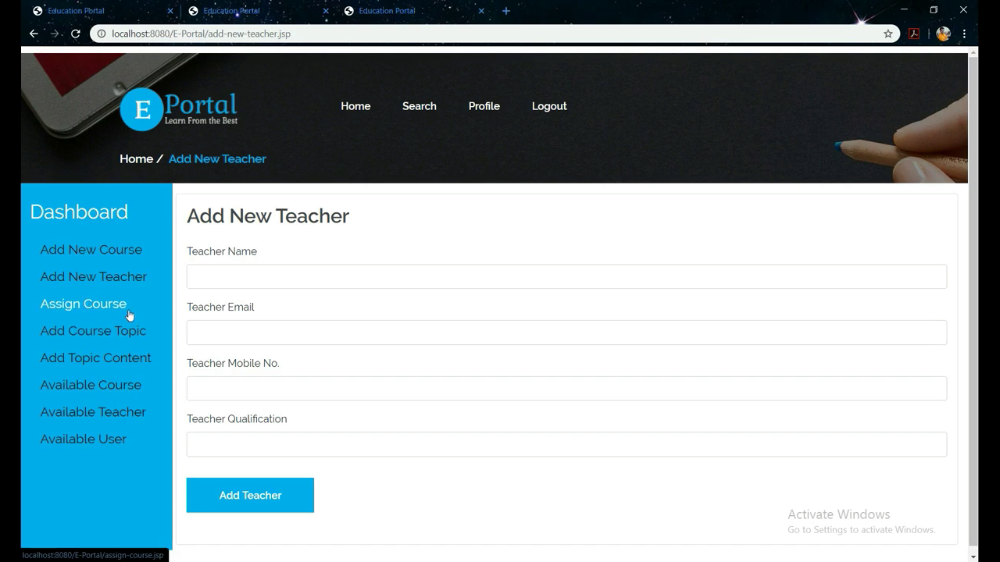
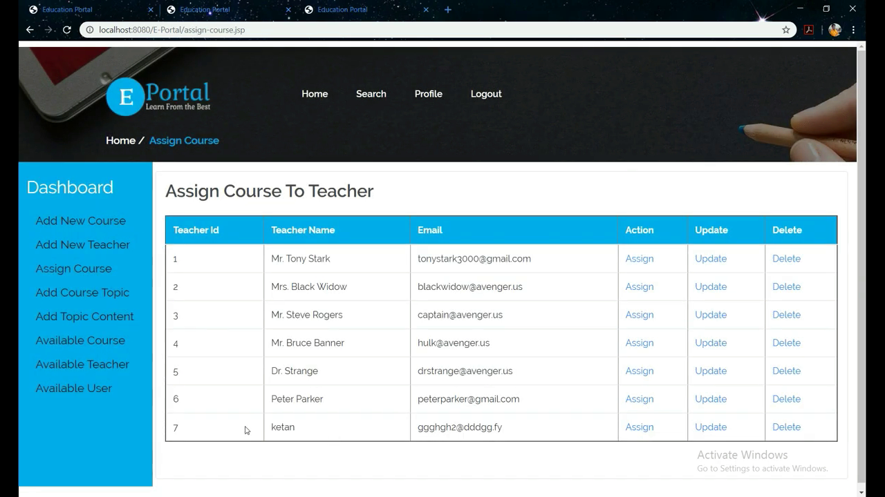

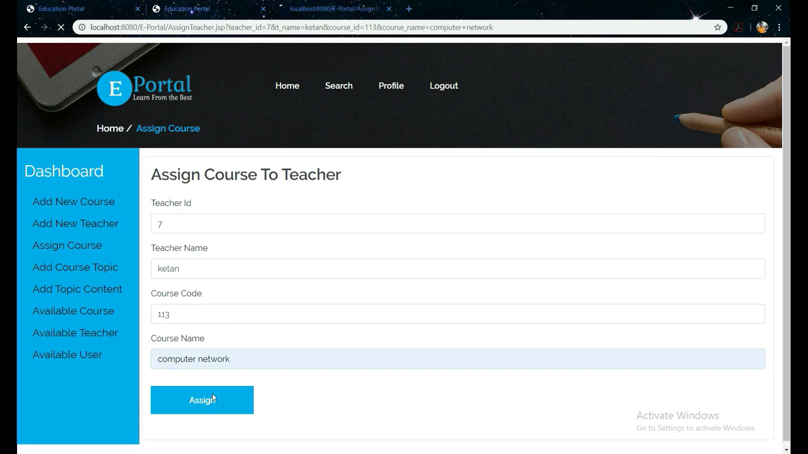
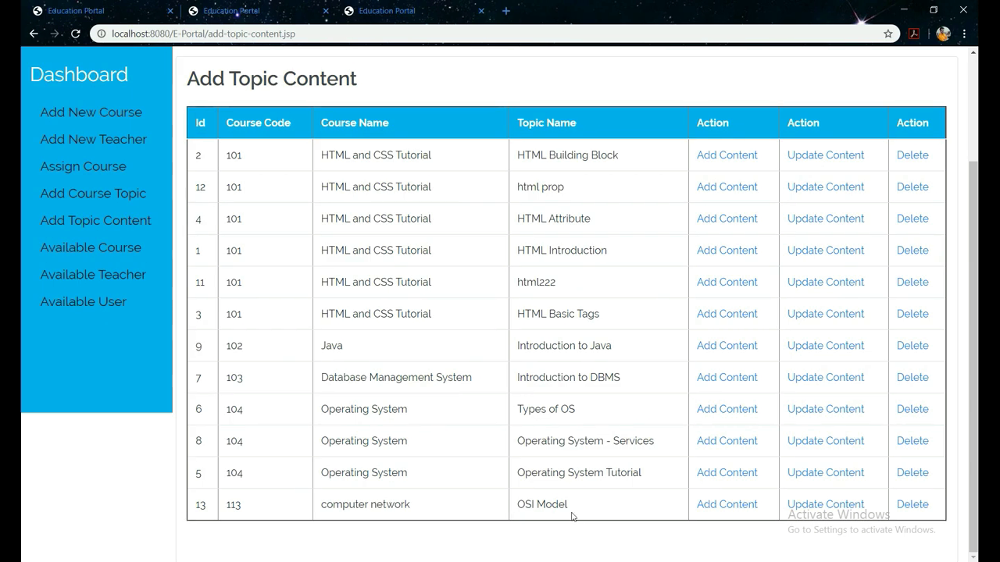
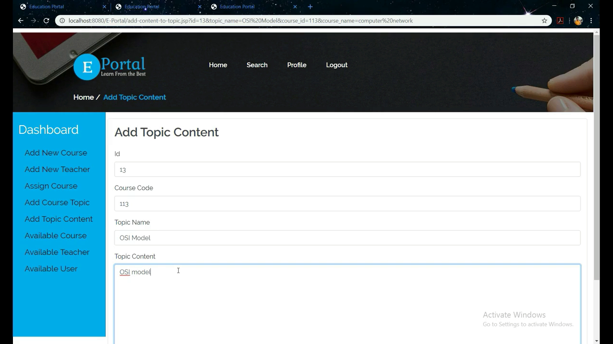
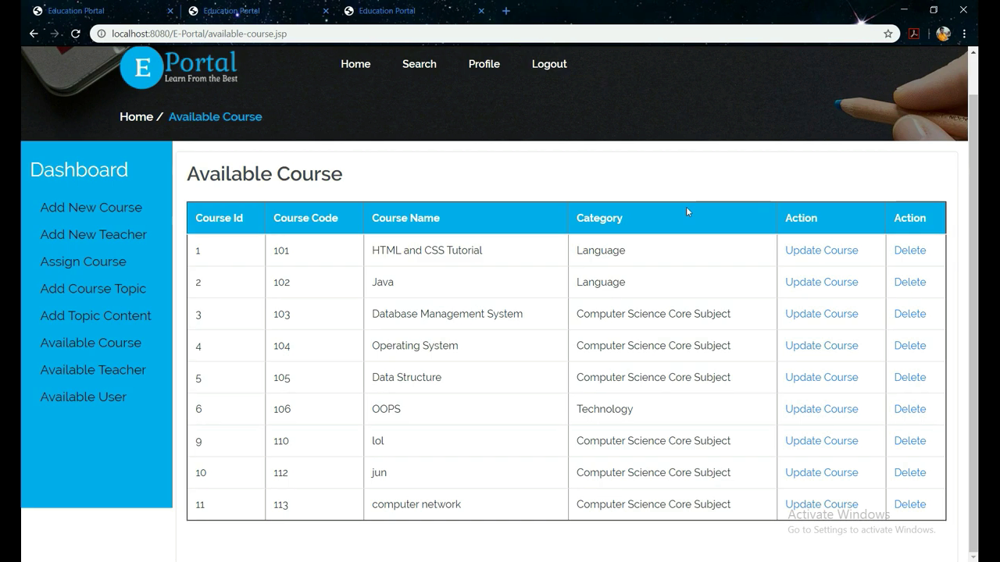
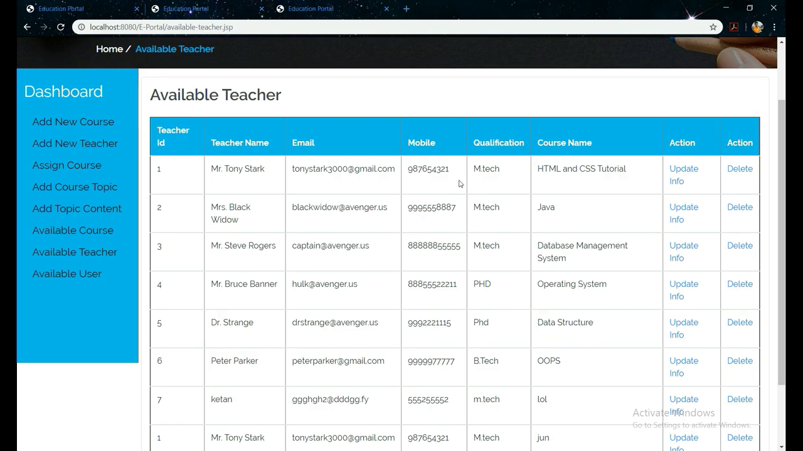
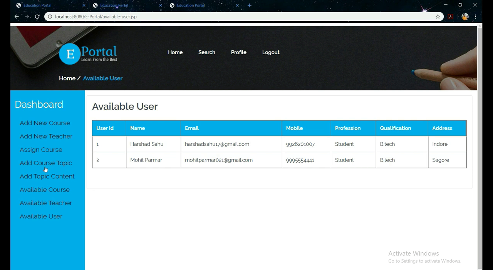
